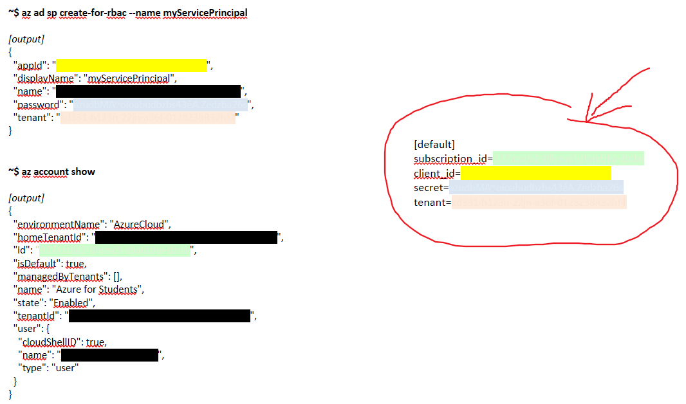

# TUTO DLC - Configuration Management Tools and Infrastructure as Code


The goal of this tutorial is to deploy an infrastructure using code (**IaC**).

IaC for Infrastructure as Code, is a type of IT configuration that allows to automatically manage and provision IT infrastructure through code without going through manual processes [1].

To do this, we have a multitude of tools supporting IaC. These can be grouped into two categories according to the languages they support: Declarative Language (Only specify what to do) et Procedural Language (Specify in detail how to do the task).

Thus, we have choosen two tools based on categories presented : 
- [**Ansible**](https://docs.ansible.com/ansible/latest/index.html), based on Declarative language and 
- [**Terraform**](https://www.terraform.io/docs/index.html), based on Procedural Language.

For this tutorial needs, we will use an existing application project named [**DOODLE**](https://github.com/selabs-ur1/doodle). 

### Description
The doodle app is made up by :
- a **back** which is developed using the [quarkus.io](https://quarkus.io/) framework
- a **front** which is developed in [angular](https://angular.io/) using the [primeng](https://www.primefaces.org/primeng/)  angular UI component library and the [fullcalendar](https://fullcalendar.io/) graphical component

Our Infrastructure will be composed by two machines myVM4DoodleFrontEnd for the front and myVM4DoodleBackEnd for the back. The work area on this app will be limited on the front end part. We will only deploy a machine, by the mean of IaC tools, which will support the front end of the app. This front vm, to launch properly the front component of the doodle app will needs : 
- a Webserver app; we chose Apache
- to allow connection from internet on 80 port (http ones) 
- to have in a scpecific path (the webserver one) the front end doodle app code compiled

### Requirements
To realize this tutorial, you must have :
- a professional mail adress (from your school) to create a free account to use some cloud providers services. *No needs of Credit card*


## Ansible
*Useful resources for Ansible overview:*
- [Introduction](https://www.youtube.com/watch?v=Cisg9bLhLkk&t=1s&ab_channel=xavki)
- [Notion_and_definitions](https://www.youtube.com/watch?v=tirjpYSMkkM&ab_channel=xavki)

To deploy the infrastructure needed to launch the front end part of doodle app, will have chosen to use the cloud provider [Azure from Microsoft](https://azure.microsoft.com/fr-fr/free/search/?OCID=AID2200187_SEM_48fa2f35e22c1b66c2984e9a8add5db6:G:s&ef_id=48fa2f35e22c1b66c2984e9a8add5db6:G:s&msclkid=48fa2f35e22c1b66c2984e9a8add5db6). 

**Step 1: Create your free Azure acount**

Follow the *start free* instructions from [Azure student page](https://azure.microsoft.com/en-us/free/students/) to create your azure account.
As reminder, normallly no needs to fill any credit card section if you selected the creation of student account which is totally free.
Once the account created, move to `Step 2`.

**Step 2: Create a Principal of service**

On Azure, a Principal of service provides you with a dedicated account to manage Azure resources with Ansible.
Launch **Azure Cloud Shell** on Bash environnement, then accept the **creation of storage** on your Azure student account.
Once the terminal prompt available, run the command `az ad sp create-for-rbac --name myServicePrincipal` to create a principal of service.
Keep the output of the command, particularly values of `appID`, `password` and `tenant`.
Then, run `az account show` to get details on your subscription. As the past one, keep the output information, espacially `id`.

In fact, to authenticate to Azure with the service principal, you need the following:
- SubscriptionID from your account
- ApplicationId fron Principal of service
- Password of the Principal of service
- Tenant of the Principal of Service

Now, construct the pattern of the credential file to connect to your azure principal of service
<p style='text-align: center'>
    
</p>

Keep it somewhere, we will use it later.

**Step 3: Create the first machine which will be the Ansible Management principal node**

On **Azure Cloud Shell** on Bash/Powershell environnement, you have already access **ansible**. Run `ansible --version` to verify it.
Create an ansible playbook named `vm1_playbook.yml` in which we will design how to create the main machine which role will be the Ansible Server.
- Content of `vm1_playbook.yml`
```shell script
- name: Create Azure VM which role will be the Ansible Server
  hosts: localhost
  connection: local
  vars_prompt:
    - name: password
      prompt: "Enter the new VM local administrator password"
  tasks:
  - name: Create resource group
    azure_rm_resourcegroup:
      name: tutoDLCAnsible-rg
      location: eastus
  - name: Create virtual network
    azure_rm_virtualnetwork:
      resource_group: tutoDLCAnsible-rg
      name: myVnet
      address_prefixes: "178.0.0.0/16"
  - name: Add subnet
    azure_rm_subnet:
      resource_group: tutoDLCAnsible-rg
      name: mySubnet
      address_prefix: "178.0.10.0/24"
      virtual_network: myVnet
  - name: Create public IP address
    azure_rm_publicipaddress:
      resource_group: tutoDLCAnsible-rg
      allocation_method: Static
      name: myPublicIP
    register: output_ip_address
  - name: Public IP of VM
    debug:
      msg: "The public IP is {{ output_ip_address.state.ip_address }}."
  - name: Create Network Security Group that allows ONLY SSH
    azure_rm_securitygroup:
      resource_group: tutoDLCAnsible-rg
      name: myNetworkSecurityGroup
      rules:
        - name: SSH
          protocol: Tcp
          destination_port_range: 22
          access: Allow
          priority: 1001
          direction: Inbound
  - name: Create Network Security Group to allow Doodle app works
    azure_rm_securitygroup:
      resource_group: tutoDLCAnsible-rg
      name: myNetworkSecurityGroup1
      rules:
        - name: SSH
          protocol: Tcp
          destination_port_range: 22
          access: Allow
          priority: 1001
          direction: Inbound
        - name: port_80
          protocol: Tcp
          destination_port_range: 80
          access: Allow
          priority: 1002
          direction: Inbound
  - name: Create virtual network interface card
    azure_rm_networkinterface:
      resource_group: tutoDLCAnsible-rg
      name: myNIC
      virtual_network: myVnet
      subnet: mySubnet
      public_ip_name: myPublicIP
      security_group: myNetworkSecurityGroup
      private_ip_allocation_method: Static
      private_ip_address: 178.0.10.210
  - name: Create VM
    azure_rm_virtualmachine:
      resource_group: tutoDLCAnsible-rg
      name: myVM4AnsibleServer
      vm_size: Standard_DS1_v2
      admin_username: azureuser
      admin_password: "{{ password }}"
      network_interfaces: myNIC
      image:
        offer: CentOS
        publisher: OpenLogic
        sku: '7.5'
        version: latest
```

As explanation:
1. The task named `Create resource group` will create a groupe of resouces to which the `myVM4AnsibleServer` will be part of. In Azure, the concept of **resource group** is a container that holds related resources (Virtual machines, storage accounts, web apps, databases, and virtual networks...); even Resource groups, subscriptions, management groups, and tags are also examples of resources. A good practice in azure is to affect to resource groups resources to well manage them. [useful_link](https://docs.microsoft.com/en-us/azure/azure-resource-manager/management/overview#resource-groups). This resource will be called **tutoDLCAnsible-rg**
2. The tasks named `Create virtual network`, `Add subnet`, `Create public IP address` will respectively create virtual network, a subnetwork and a public IP adress wich will be affected to the resource **tutoDLCAnsible-rg** and will be used by an network interface.
3. The tasks named `Create Network Security Group that allows ONLY SSH` and `Create Network Security Group to allow Doodle app works` will create Network rules respectivly for **vm1** and then for the **frontend-vm**. You will notice that the **frontend-vm**  must have the port 80 open and reacheable from internet to access easly to the front off the doodle app.
4. The task named `Create virtual network interface card` will setup the network interface with the previous virtual network, subnet, Public IP adress, network rules and fix a static IP private.
5. The last task `Create VM` will create finaly create the desired machine.


Run `ansible-playbook vm1_playbook.yml` to excute the playbook. *Remider*: you will have to enter the password for the **myVM4AnsibleServer**'s user.
Note the Public IP adress of your new vm `myVM4AnsibleServer` created.

Verify if the vm is launched. For that go in `group resource`, then in `tutoDLCAnsible-rg` and select `myVM4AnsibleServer`; you will get detail on the state of the vm.


**Step 4: Connection to the virtual machine created using ssh**
Using the SSH command, connect to the public IP address of your virtual machine.
`ssh azureuser@<vm_public_ip_address>` and replace <vm_public_ip_address> with the appropriate value returned in the previous commands.


**Step 5: Install Ansible on the virtual machine created**
After the connection established, run the following command on your CentOS Machine `myVM4AnsibleServer` created :

*//Update all packages that have available updates.*
`sudo yum update -y`

*//Install Python 3 and pip.*
`sudo yum install -y python3-pip`

*//Upgrade pip3.*
`sudo pip3 install --upgrade pip`

*//Install Ansible.*
`pip3 install "ansible==2.9.17"`

*//Install Ansible azure_rm module for interacting with Azure.*
`pip3 install ansible[azure]`

*//Test Ansible*
`ansible --version`


**Step 6: Connect your `myVM4AnsibleServer` to your azure account**

Still connected to `myVM4AnsibleServer` via ssh, create and open a file nammed `credentials`
```shell script
mkdir ~/.azure
nano ~/.azure/credentials
```
The content following the pattern kept in the **step 2** section, paste it in the `credentials` file created. Save and close it.


**Step7: Create the `myVM4DoodleFrontEnd` machine for the front end using Iac process of Ansible**

Following likely the same process as the one in **step 3**, create a playbook named `frontEndVm_playbook.yml` on the `myVM4AnsibleServer`, which content is :
```shell script
- name: Create Azure VM which role will be the Front End of Doodle App
  hosts: localhost
  connection: local
  vars_prompt:
    - name: password
      prompt: "Enter local administrator password"
  tasks:
  - name: Create public IP address
    azure_rm_publicipaddress:
      resource_group: tutoDLCAnsible-rg
      allocation_method: Static
      name: myPublicIP1
    register: output_ip_address
  - name: Public IP of VM
    debug:
      msg: "The public IP is {{ output_ip_address.state.ip_address }}."
  - name: Create virtual network interface card
    azure_rm_networkinterface:
      resource_group: tutoDLCAnsible-rg
      name: myNIC1
      virtual_network: myVnet
      subnet: mySubnet
      public_ip_name: myPublicIP1
      security_group: myNetworkSecurityGroup1
      private_ip_allocation_method: Static
      private_ip_address: 178.0.10.230
  - name: Create VM
    azure_rm_virtualmachine:
      resource_group: tutoDLCAnsible-rg
      name: myVM4DoodleFrontEnd
      vm_size: Standard_DS1_v2
      admin_username: azureuser1
      admin_password: "{{ password }}"
      network_interfaces: myNIC1
      image:
        offer: CentOS
        publisher: OpenLogic
        sku: '7.5'
        version: latest
```

Then run the command `ansible-playbook frontEndVm_playbook.yml`
Let notice that for this machine, the static private IP adress given is **178.0.10.230**

**Step 8: Create a Certificate to allow ssh connection from the `myVM4AnsibleServer` to the `myVM4DoodleFrontEnd`**

On the `myVM4AnsibleServer`, test the connection with `myVM4DoodleFrontEnd` running `ping 178.0.10.230`.
Then run the command `ssh-keygen -m PEM -t rsa -b 4096` to generate an authentication certificate. (Don't bother yourself to write passphrase). Normaly, the certificate has been generated in the default folder */home/azureuser/.ssh/id_rsa*. Now send the public key to the `myVM4DoodleFrontEnd` running `ssh-copy-id -i /home/azureuser/.ssh/id_rsa azureuser1@178.0.10.230`, enter the password chosen for the `myVM4DoodleFrontEnd` administrator user, and it will be ok. Then, create a file `hosts` which will note the differents nodes, run `nano hosts`. Its content is : 
```shell script
# ~/ansible/hosts
[frontend_nodes]
azureuser1@178.0.10.230
```
To test if the certificate will be taken for following connection with the front machine run `ansible all -m ping -v -i ./hosts`


**Step 9: Complete the structure of our infrastructure by installing requirements to launch properly doodle front end**

On the `myVM4AnsibleServer`, write a new ansible playbook to install the webserver apache2 and the compiled project of doodle front. Run `nano install_FE_requirement.yml`, fill it with :
```shell script
---
- name: This sets up requirements for Front End of Doodle App
  hosts: azureuser1@178.0.10.230
  become: yes
  tasks:
  - name: Install apache packages
    yum:
      name: httpd
      state: present
  - name: ensure httpd is running
    service:
      name: httpd
      state: started
  - name: Open port 80 for http access
    firewalld:
      service: http
      permanent: true
      state: enabled
  - name: Restart the firewalld service to load in the firewall changes
    service:
      name: firewalld
      state: restarted
  - name: Intall the Front End of Doodle project
    ansible.builtin.unarchive:
       src: https://github.com/ewiibo/DLC-doodleFE-compiled/archive/refs/heads/master.zip
       dest: /home/azureuser1/
       remote_src: yes
  - name: Copy the file in the apache server folder
    ansible.builtin.copy:
       src: /home/azureuser1/DLC-doodleFE-compiled-master/dist/tlcfront/
       dest: /var/www/html
       remote_src: yes
  - name: Restart the Apache serveur
    service:
       name: httpd
       state: restarted
```
Then run `ansible-playbook -i ./hosts ~/install_FE_requirement.yml -K`

**Step 10: Test your doodle app front end through internet**

Open on your computer an internet navigator, then launch the public IP address of your `myVM4DoodleFrontEnd`; it is supposed to give you the front of doodle project.


**Conclusion**

As you saw through this tutorial, based on Iac and using appropriated tools, you can rapidly deploy an infrastruce for a specific needs. Normaly, in your environnement, you will have a sepcific machine which role will be the Ansible Management Nodes, connected to a cloud service, and with some playbook well designed, you will be able to deploy rapidly the infrastructure you want. Isn't it GREAT, Infrastructure As Code 😀.


## Liens utiles
- [1] https://www.lebigdata.fr/infrastructure-as-code-definition